# Módulo 5: Controle de Qualidade

**Instrutor:** 3º Sgt Gustavo Pereira

## Objetivos de Aprendizagem
- [ ] Compreender o Workflow Toolbox
- [ ] Construir modelos usando o modelador Gráfico
- [ ] Compreender especificidades dos modelos
- [ ] Montar workflows completos
- [ ] Executar workflows existentes
- [ ] Trabalhar com modalidades de tratamento

## Pré-requisitos
> **📋 Pré-requisito:** Todos os módulos anteriores concluídos

## 1. Workflow Toolbox
 **Introdução**
Neste módulo, será apresentado o uso da ferramenta **Workflow Toolbox** do DSGTools, responsável pela automação e padronização de processos de controle de qualidade de dados geoespaciais. A ferramenta permite o encadeamento de algoritmos (Modelos) e o monitoramento de execuções, otimizando o tempo e reduzindo erros.

### 1.1 Conceitos Fundamentais
O Workflow Toolbox é a ferramenta de validação de dados geoespaciais do plugin DSGTools. Sua principal finalidade é garantir que os dados obedeçam a uma padronização previamente definida, por meio da execução de fluxos compostos pelo próprio usuário, a partir da combinação de Modelos (ou models), que representam processos ou algoritmos específicos. Cada modelo executa uma tarefa pontual, como verificar topologias, validar atributos ou checar relações espaciais. A junção desses modelos em uma sequência controlada constitui o workflow.
A utilização do Workflow Toolbox possibilita:
- Automatizar rotinas de validação que, manualmente, seriam longas e sujeitas a erros;
- Aplicar regras padronizadas a diferentes conjuntos de dados;
- Registrar exceções e identificar inconsistências;
- Facilitar o controle de qualidade

A construção dos modelos será abordada detalhadamente na Unidade 2 deste módulo..

### 1.2 Arquitetura do Sistema
A arquitetura do Workflow Toolbox foi desenvolvida para oferecer flexibilidade, modularidade e controle durante os processos de validação de dados geoespaciais. A ferramenta está estruturada em três componentes principais:

- **Modelos (Models)**: São unidades funcionais que executam tarefas específicas, como checagens topológicas, análise de atributos, validações geométricas ou relacionais. Cada modelo pode ser reutilizado em diferentes workflows.

- **Workflows**: Representam a sequência lógica de execução dos modelos. São compostos por etapas interligadas, nas quais a saída de um modelo pode servir como entrada para o próximo. A ordem de execução, as dependências e as configurações são definidas pelo usuário.

- **Gerenciador de Execução (`Caixa de Ferramentas de validação de dados Geoespaciais`) : Responsável por controlar o andamento do workflow. Monitora o status de cada etapa (pendente, em execução, concluída ou com erro), permite pausas, retomadas, reexecuções e registro das exceções.
  
### 1.3 Interface do Usuário
A interface do Workflow Toolbox foi projetada para oferecer uma experiência visual clara e funcional durante a configuração e execução dos workflows. A ferramenta é acessada por meio do menu do DSGTools, dentro do ambiente do QGIS.

A interface principal é composta pelos seguintes elementos:

- 1- Painel de Workflows: localizado no topo da tela, exibe os workflows disponíveis no projeto, permitindo selecionar, abrir e criar novos fluxos de validação.

- 2- Visualizador de Etapas: ao selecionar um workflow, é apresentada uma visualização sequencial das etapas (modelos) que o compõem, com indicadores de status (✔️ concluído, ⏳ em execução, ❌ com erro, etc.).

- 3- Ferramentas: permite ao usuário adicionar ou remover workflows, além de visualizar e editar os parâmetros e modelos utilizados na execução. Entre as opções disponíveis, é possível configurar ações como: interromper após a execução, permitir falsos positivos, definir o comportamento da camada de saída, entre outras.

- 4- Barra de Ações (parte inferior): disponibiliza botões para iniciar, pausar e retomar a execução a partir do último modelo processado.

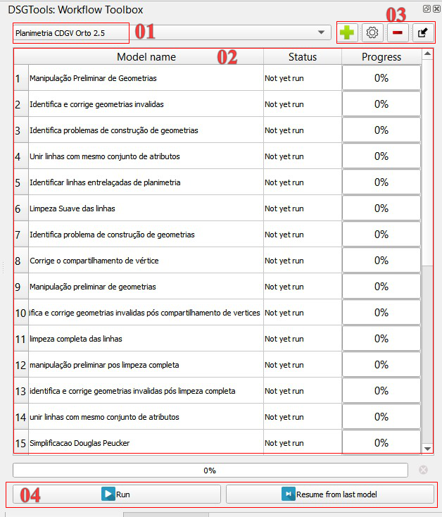
      
  *Figura 1.1: Interface Workflow Toolbox no QGIS*

### 1.4 Integração com QGIS Processing
O Workflow Toolbox é construído sobre o framework de Processamento do QGIS (QGIS Processing), o que permite que os modelos criados no DSGTools utilizem diretamente algoritmos já existentes no ambiente QGIS.

Essa integração amplia consideravelmente as possibilidades da ferramenta, permitindo que os usuários:

- Incorporem algoritmos nativos do QGIS nos modelos, como validações topológicas, operações de geoprocessamento, seleções espaciais e filtros por atributos;

- Utilizem scripts personalizados (Python ou R) registrados como algoritmos no QGIS Processing;

- Aproveitem funcionalidades de plugins externos, desde que compatíveis com o sistema de processamento do QGIS;

- Definam parâmetros e entradas de forma padronizada, mantendo consistência entre modelos e workflows.
  
 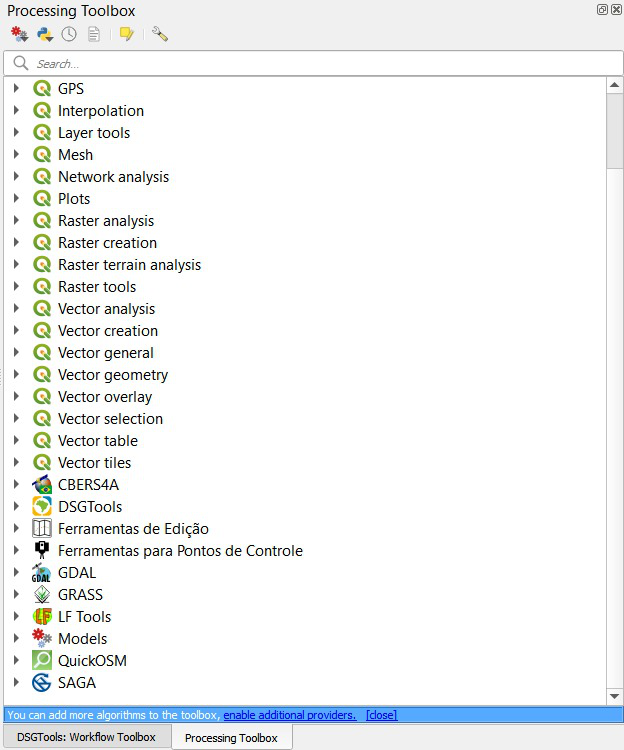
      
  *Figura 1.2: Interface processing*

## 2. Como Montar os Models
 A etapa de construção dos Modelos (ou models) é fundamental para o funcionamento do Workflow Toolbox. Para facilitar esse processo, o QGIS oferece o Modelador gráfico, uma interface dedicada à criação e configuração dos modelos. Com essa ferramenta, o usuário pode montar fluxos internos, definir parâmetros de entrada e saída, e personalizar a lógica de validação de acordo com os requisitos do projeto.

 O acesso a interface é feito no QGIS como mostrado abaixo:

 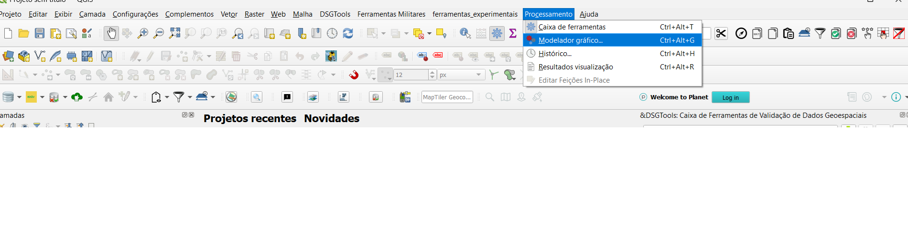

*Figura 2.1: Interface do painel*

### 2.1 Interface do Modelador Gráfico do QGIS

A seguir, estão os principais componentes da interface do Modelador Gráfico, conforme numerados na imagem:

 **01 – Barra de Ferramentas Principal**
Contém os botões para:
- Criar, abrir e salvar modelos;
- Adicionar elementos;
- Desfazer/refazer ações;
- Ajustar o layout da visualização;
- Executar o modelo;
- Acessar configurações e ajuda.

---

 **02 – Painel de Algoritmos**
Lista todos os algoritmos disponíveis organizados por categoria (como "Análise vetorial", "Raster", "Banco de Dados", etc). Aqui você pode:
- Pesquisar algoritmos;
- Arrastar algoritmos para o canvas (área central) e compor seu modelo.

---

 **03 – Painel de Entradas**
Exibe os tipos de **entradas necessárias** para o modelo funcionar, como:
- Camadas vetoriais ou raster;
- Parâmetros de texto, número, booleano, arquivos, pastas, etc.

> ⚙️ **Dica:** Você deve arrastar as entradas necessárias para dentro do modelo (área central) para configurar os parâmetros esperados!

---

 **04 – Canvas de Modelagem**
É a **área principal** onde você constrói o fluxo do seu modelo.
- Aqui você arrasta os algoritmos e define as conexões entre entradas, processos e saídas.
- É onde o modelo visual toma forma, com o encadeamento entre as etapas do processamento.

---

 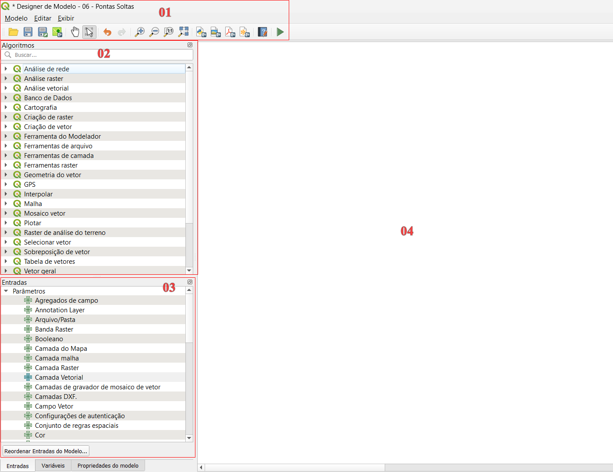

*Figura 2.2: Interface do Modelador Gráfico*

### 2.2 Construção no Canvas
  Exemplo de estrutura básica de um modelo que segue três etapas:

---

 🟨 1. **Entradas**
As entradas são os dados ou parâmetros que o modelo irá utilizar. Elas podem ser:
- Camadas vetoriais ou raster
- Números, textos, opções booleanas
- Pastas ou arquivos
- Outros parâmetros definidos pelo usuário

Essas entradas são configuradas no início do modelo e podem ser reutilizadas em diferentes partes do fluxo.

---

 ⚙️ 2. **Processamento (Transformações)**
São os algoritmos da aba *Processing* que realizam ações sobre os dados de entrada. Podem incluir:
- Ferramentas de análise espacial
- Operações de geoprocessamento
- Cálculos, filtros, seleções
- Conversões e validações

Os algoritmos podem ser conectados em sequência, onde a saída de um se torna a entrada do próximo.

---

 🟩 3. **Saídas**
As saídas são os resultados gerados após o processamento. Podem ser:
- Camadas vetoriais ou raster processadas
- Tabelas
- Arquivos intermediários ou finais

Essas saídas podem ser salvas, reutilizadas ou utilizadas como insumo em outros modelos.

---
 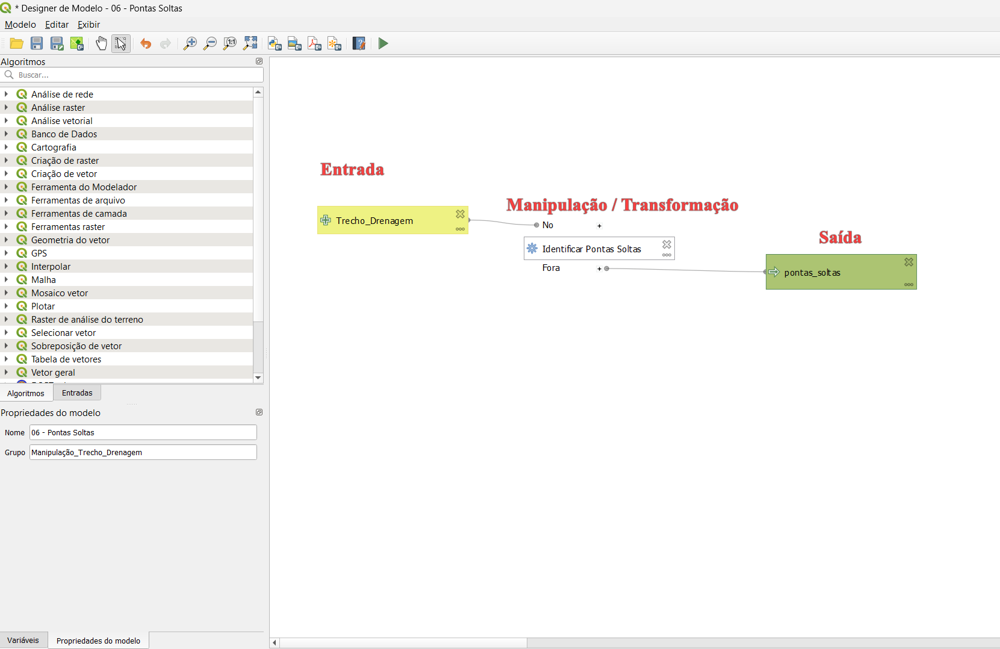

  *Figura 2.3: Interface do Modelador Gráfico Canvas*

> ⚙️ **Dica:** Após montar seu modelo, você pode salvar e reutilizar o fluxo de trabalho como uma ferramenta personalizada dentro do QGIS!

### 2.3  Algoritmos e Processamento
 O Model Helper permite utilizar algoritmos do QGIS Processing Framework, Incluindo processing de plugins como o DSGTools. Esses algoritmos são os blocos fundamentais dos modelos, executando tarefas como:

📏 Validação Geométrica

- Checar geometrias inválidas
- Detectar polígonos sobrepostos ou com buracos
- Eliminar duplicatas
  
---

🔍 Análise de Atributos

- Verificar preenchimento de campos obrigatórios
- Identificar valores fora de domínio
- Validar relacionamentos entre tabelas

---

🌐 Validação Espacial

- Verificar se feições estão dentro da área de interesse
- Checar interseções, contenções ou adjacências entre camadas
- Confirmar presença ou ausência de feições em regiões específicas

---

⚙️ Outros Processamentos

- Aplicar buffers, dissoluções, recortes
- Reclassificar feições
- Exportar resultados como novas camadas

---

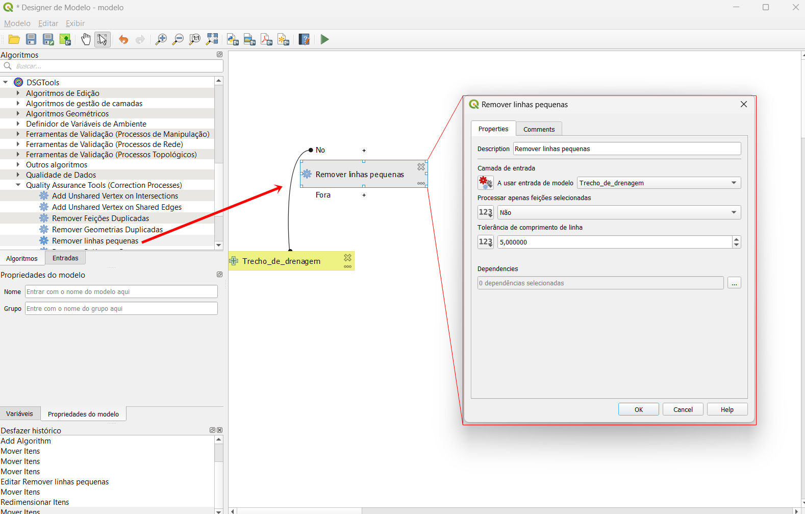

  *Figura 2.4: Algoritmos do QGIS e do DSGTools disponíveis*

> ⚙️ **Dica:**: Antes de construir seu modelo completo, teste os algoritmos individualmente no menu “Processamento” do QGIS. Isso ajuda a entender os parâmetros necessários e os resultados esperados.

#### 2.4 Funcionalidades do Model 

 Neste tópico abordaremos sobre as funcionalidades disponíveis que serão úteis na construção dos modelos que está acessível na aba superior:

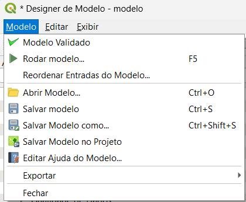

 *Figura 2.5: Funcionalidades da aba superior*

- ✅ Modelo Validado
Verifica se o modelo está corretamente estruturado (sem conexões ausentes, parâmetros obrigatórios em falta etc.). Essa verificação é essencial antes de rodar.

- ▶️ Rodar Modelo (F5)
Executa o modelo de forma isolada, sem necessidade de estar vinculado a um workflow.

- 🔀 Reordenar Entradas
Permite definir a ordem de solicitação dos parâmetros ao usuário durante a execução.

- 📂 Abrir / Salvar / Salvar como...
Gerencia os arquivos de modelos (extensão .model3) para reutilização e backup.

- 📌 Salvar no Projeto
Associa o modelo diretamente ao projeto .qgz, facilitando o versionamento e compartilhamento.

- 📝 Editar Ajuda do Modelo
Permite inserir uma descrição personalizada que será exibida para o usuário durante a execução.

- 📤 Exportar
Gera um arquivo externo para compartilhar o modelo com outros projetos ou usuários.

> ⚙️ **Dica:**: Para garantir que seu modelo funcione corretamente no Workflow Toolbox, sempre valide antes de salvar. Modelos com erros de conexão ou parâmetros ausentes não são executados.

### 2.5 Tutorial Prático: Criando um Modelo

 Nesta seção, será abordada a construção dos modelos (models) utilizados nos workflows. Os modelos representam fluxos de validação automatizados, formados por algoritmos encadeados que operam sobre os dados geoespaciais. O QGIS fornece um ambiente visual, chamado Modelador Gráfico, que permite criar esses fluxos de forma interativa, sem necessidade de programação.

- 🟢 Passo 1 – Abrindo o QGIS e o Modelador Gráfico
Abra o QGIS e acesse o Modelador Gráfico por meio do menu:

`Menu → Processing → Modelador Gráfico`

Você verá uma tela com o canvas vazio, onde os algoritmos e entradas serão adicionados.

---

- 🧩 Passo 2 – Adicionando um Algoritmo
Na aba lateral Algoritmos, pesquise por “Verificador de Geometria Inválida” (ou o algoritmo equivalente usado no DSGTools). Dê dois cliques ou arraste para o canvas.

 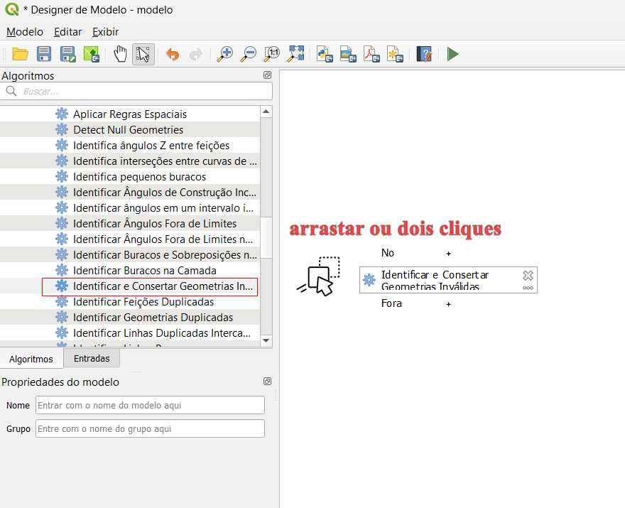

 *Figura 2.6: tutorial 01*

---

- 🔧 Passo 3 – Definindo os Parâmetros de Entrada
Assim que o algoritmo for inserido, será aberta uma janela solicitando os parâmetros.

O primeiro parâmetro será a camada de entrada. Clique no campo correspondente e selecione a opção de camada desejada.

 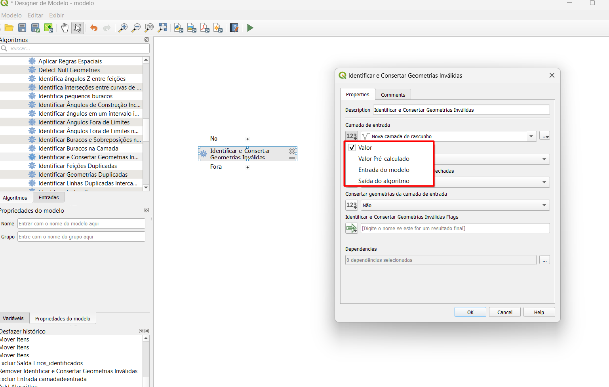

 *Figura 2.7: tutorial 01*

- 🔧 Passo 3.1  Tipos de Entrada Disponíveis
Você poderá escolher entre diferentes tipos de entrada:

  Este tipo de entrada exibe apenas as camadas que estão carregadas no QGIS no momento da execução. Funciona bem para operações simples em uma camada específica já visível no projeto:
  
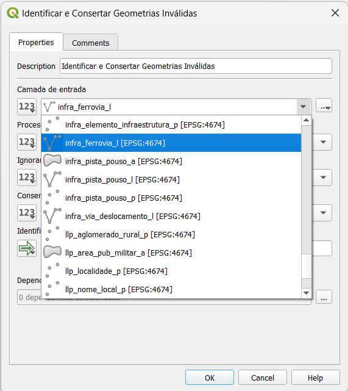

*Figura 2.8: tutorial 01.1*

 Esse tipo é mais avançado. Ele solicita uma expressão da calculadora de campo, permitindo:
- Criar variáveis dinâmicas;
- Filtrar feições automaticamente;
- Puxar múltiplas camadas com base em uma lógica definida.
  
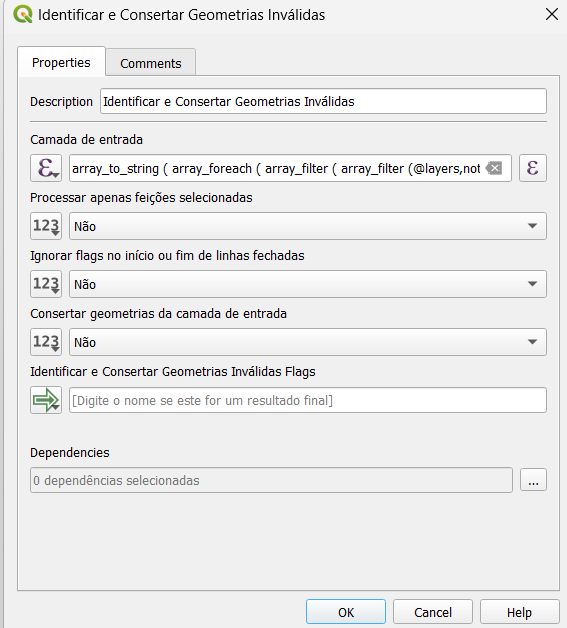

 *Figura 2.9: tutorial 02*

 Aqui, o modelo apenas define o tipo de geometria aceito (ponto, linha ou polígono), pode ser outras entradas além de geometria, mas a camada real será escolhida pelo usuário no momento da execução. É útil quando o modelo precisa ser flexível e aplicável a diferentes conjuntos de dados.
 
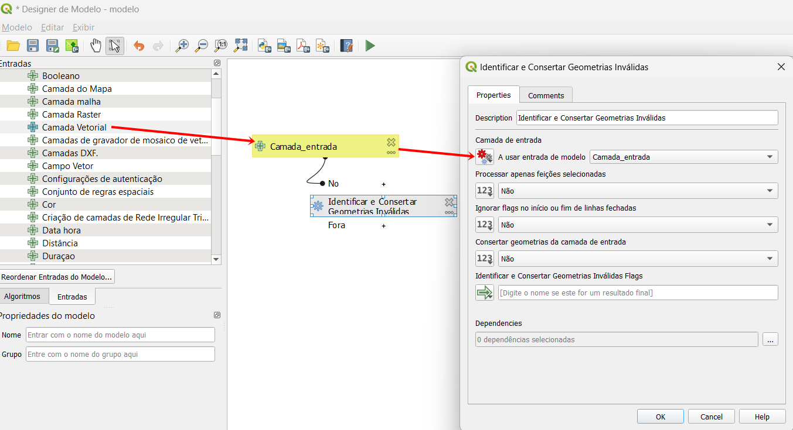

 *Figura 2.10: tutorial 03*

 Este tipo permite usar a saída de um algoritmo anterior como entrada de outro, facilitando o encadeamento de processos. É indispensável quando se precisa aplicar um tratamento em sequência, como validação → filtragem → exportação.
 
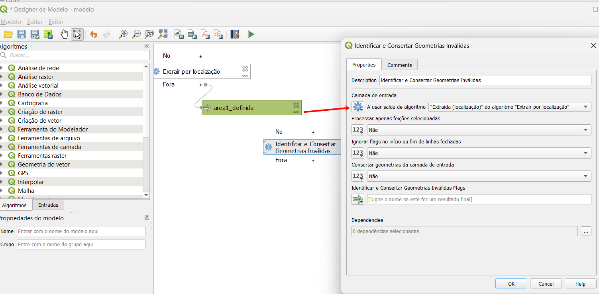

 *Figura 2.11: tutorial 04*

Para este exemplo, utilizaremos a entrada do tipo Camada Vetorial

---

- 🏁 Passo 4- – Nomeando a Saída
Defina o nome da camada de saída, por exemplo: “Erros Identificados”. Isso facilitará a identificação do resultado após a execução.

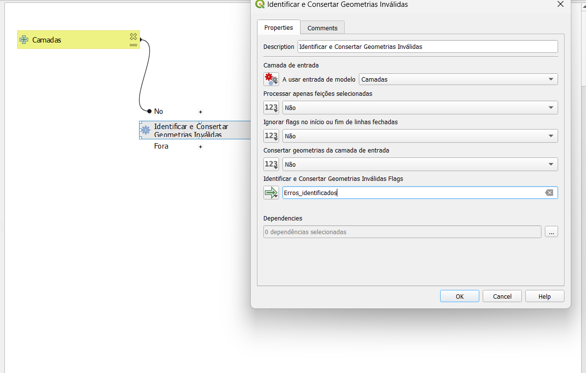

 *Figura 2.12: tutorial saida*

---

- 💾 Passo 5 – Salvando e Executando o Modelo
Com tudo configurado, clique em:

Menu → Modelo → Salvar como...
Escolha uma pasta e salve com um nome representativo, como verifica_geometria.model3.

Em seguida, clique em `Rodar Modelo (F5` para iniciar a execução.

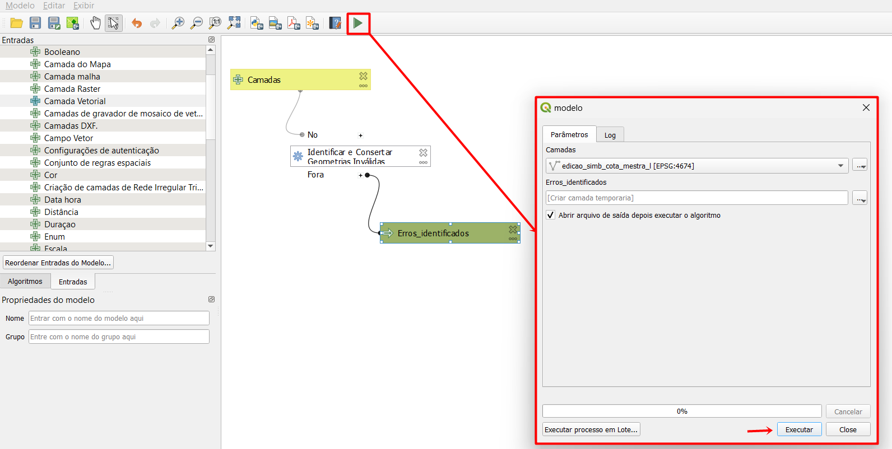

 *Figura 2.13: tutorial execução*

---

- 🟢 Resultado Final
O QGIS irá processar os dados e gerar a camada de saída com os erros encontrados. Você poderá visualizar essas geometrias diretamente no mapa.

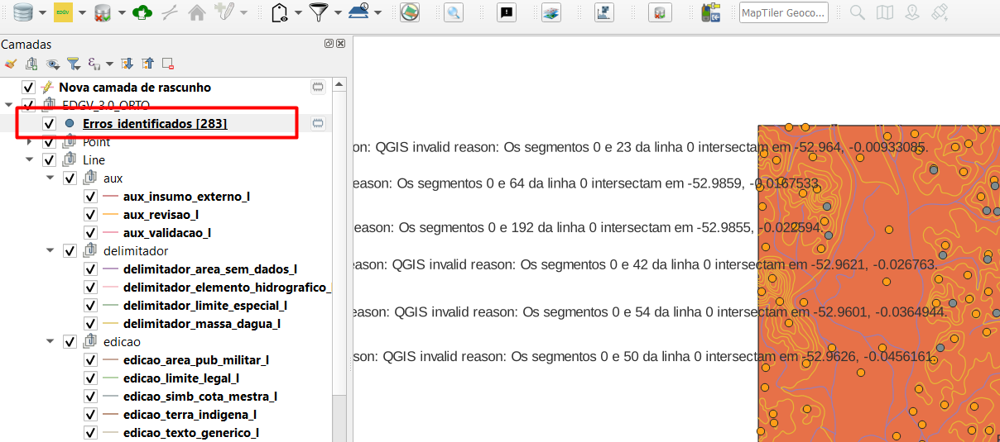

 *Figura 2.14: tutorial Resultado*

## 3. Como Montar o Workflow
 Com os modelos prontos, podemos organizá-los em um workflow para executar uma sequência de validações automaticamente, economizando tempo e garantindo consistência no processo.

A ferramenta Workflow Toolbox, dentro do plugin DSGTools, é responsável por essa organização. Nela, é possível:

- Criar um novo fluxo (workflow);
- Inserir os modelos (modelos .model3);
- Definir a ordem de execução;
- Configurar opções de tratamento como falso positivo, etapas obrigatórias e mais.

### 3.1 Acessando a Ferramenta
Acesse a ferramenta pela barra do DSGTools:

`DSGTools → Ferramentas de Produção → Workflow Toolbox`

A interface será exibida com o painel principal: Selecionar workflow, Adicionar e importar.

Figura 3.1 – Interface da Workflow Toolbox

---

### 3.2: Criar um Novo Workflow
Clique no botão Novo Workflow (ícone de “+”) para iniciar a criação.

Escolha um nome descritivo, como Validação Geometria e Topologia;

Defina o Nome do autor e versão do fluxo de trabalho;

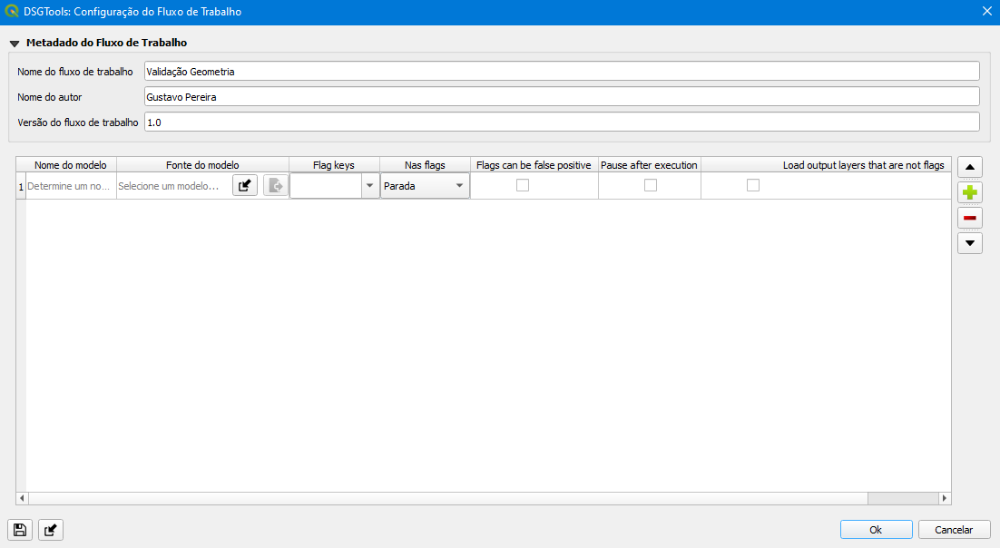

Figura 3.2 – Interface da Workflow Toolbox

---

### 3.3: Adicionar Etapas (Models)
Clique em Adicionar (ícone de “+”) no canto esquerdo para incluir um modelo:

Dê um nome para a etapa (ex: “Verificar Geometrias Inválidas”);

Defina a fonte do modelo selecionando o arquivo .model3;

Marque a camada de Flags se for o caso;

Especifique o comportamento das flags, definindo se o modelo deve interromper a execução, ignorar a ocorrência ou apenas emitir um aviso, e indique se falsos positivos serão aceitos.

Figura 3.3 – Adicionando uma etapa ao workflow

---

### 3.4 Salvando e Reorganizando
Você pode adicionar quantos modelos quiser. Eles serão executados na ordem em que aparecem. Utilize os botões da esquerda para reordenar, duplicar ou remover etapas.

Finalize clicando em Salvar Workflow na parte inferior.

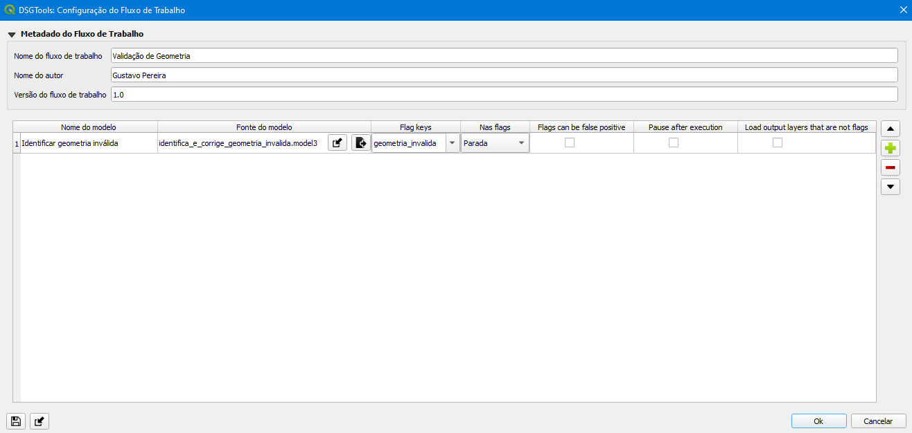

Figura 3.4 – Adicionando model ao workflow

---

## 4. Modalidades de Tratamento
Durante a configuração de cada etapa de um workflow, o usuário pode definir como o sistema deve se comportar diante de inconsistências. Isso é feito por meio de um conjunto de opções que aparecem na grade de parâmetros, conforme imagem abaixo:

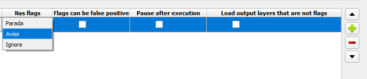

Figura 4.1 – Opções de tratamento configuráveis por etapa

As colunas disponíveis oferecem controle sobre o que fazer com os erros (flags), como e quando seguir para a próxima etapa, e o que deve ser exibido ao usuário. Abaixo, explicamos cada uma:

🔸 **Nas Flags**
Define o que o sistema deve fazer quando um erro (flag) é identificado na etapa.
Parada: interrompe imediatamente o workflow.
Aviso: exibe um aviso, mas permite continuar.
Ignorar: continua a execução sem alertar.

📝 Ideal para etapas com diferentes níveis de criticidade.

---

🔸 **Flags podem ser falso positivo**
Permite que o usuário assinale manualmente que a falha identificada não é relevante.
Marca a flag como resolvida, mesmo que tecnicamente ainda esteja presente.
Útil para exceções justificadas.

---

🔸 **Pausar após a execução**
Faz com que o workflow seja interrompido após a execução daquela etapa, aguardando ação manual do usuário antes de continuar.
Usado quando se deseja verificar visualmente os resultados antes de seguir.
Também pode ser útil para permitir edição manual intermediária.

---

🔸 **Carregar camadas de saída que não são flags**
Garante que, além das camadas de erro (flags), outras saídas do algoritmo também sejam carregadas automaticamente no QGIS.
Útil para depuração e verificação de saídas intermediárias.
Ajuda a visualizar o resultado completo da etapa.

---

## 5. Executar um Workflow Existente
Após configurar as etapas e parâmetros do seu workflow, você pode executá-lo diretamente pela interface do DSGTools. Esse processo é simples, mas envolve algumas opções que influenciam o comportamento da execução.

### 5.1 Selecionando um workflow

Na interface principal do Workflow Toolbox:

Figura 5.1 – Tela de execução 

No topo da janela, utilize o menu para importar o workflow que deseja executar.
O nome do modelo será exibido na tabela com colunas para status e progresso.

---

### 5.2 Executando o workflow
Com o modelo selecionado:

Clique no botão Executar 🔵 (localizado no canto inferior esquerdo).

A execução iniciará, seguindo a ordem das etapas definidas.

O progresso é exibido na barra inferior e na coluna "Progress" da tabela.

Caso alguma etapa tenha sido configurada como “Pausar após execução”, o processo aguardará interação manual para continuar.

---

### 5.3 Recuperando um workflow interrompido
Se a execução anterior foi interrompida ou pausada, você pode retomá-la:

Use o botão Recupera a partir do último modelo 🔁 (ao lado de “Executar”).

O DSGTools carregará o último estado salvo e continuará a partir da última etapa concluída com sucesso.

### 5.4 Verificar Resultado
Após a execução:

As flags identificadas são exibidas no QGIS.

Dependendo das configurações, camadas intermediárias (não flags) também podem ser carregadas.

O usuário pode revisar os resultados e realizar correções, se necessário.

---

## Resumo

Neste módulo você aprendeu:

* Workflow Toolbox: automatizar controle de qualidade;
* Modelador Gráfico: construir modelos;
* Integração QGIS Processing;
* Tratamento de inconsistências (flags);
* Execução e monitoramento de workflows.

---

## Material Complementar
- [Guia do Workflow Toolbox](https://exemplo.com)
- [Arquivos Workflow Toolbox](https://exemplo.com)
- [Biblioteca de Modelos](https://exemplo.com)
- [Video construção de modelos ](https://exemplo.com)
